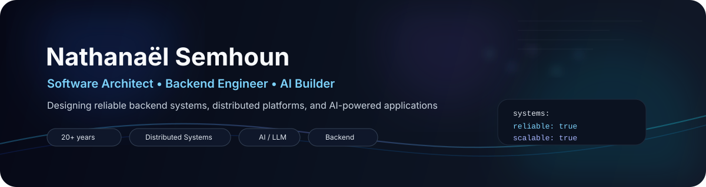

<div align="center">



<br/>


<br/>
<br/>

[](https://www.semhoun.net)
[](https://github.com/semhoun)
[](https://hub.docker.com/u/semhoun)
[](https://huggingface.co/nsemhoun)

</div>

---

## About

I’m **Nathanaël Semhoun**, a **Software Architect** and **Backend Engineer** with **20+ years of experience** building robust, scalable, and production-ready software.

My work focuses on:

- **Software architecture**
- **Backend engineering**
- **Distributed systems**
- **Telecom / VoIP infrastructure**
- **DevOps, observability, and reliability**
- **AI agents and LLM integrations**

I enjoy building systems that stay **clear, maintainable, and resilient** under real-world conditions.

---

## Signature

<table>
<tr>
<td width="52%" valign="top">

### What I optimize for

- scalable architecture
- reliability under production load
- maintainability over time
- practical AI integration
- operational simplicity
- clean engineering decisions

</td>
<td width="48%" valign="top">

```yaml
name: Nathanaël Semhoun
role: Software Architect
domains:
  - backend systems
  - distributed platforms
  - telecom / voip
  - infrastructure
  - AI / LLM applications
strengths:
  - reliability
  - clarity
  - scale
  - maintainability
```

</td>
</tr>
</table>

---

## Featured Projects

<div align="center">

<table>
<tr>
<td width="33%" valign="top">

### 🤖 [claire-chatbot](https://github.com/semhoun/claire-chatbot)

Minimal AI chat application built with **Slim 4** and **Twig**.

**Highlights**
- clean architecture
- UI + API design
- session handling
- practical LLM integration

</td>
<td width="33%" valign="top">

### 🧩 [slim-skeleton-mvc](https://github.com/semhoun/slim-skeleton-mvc)

A production-ready **Slim 4 MVC skeleton** for modern PHP applications.

**Highlights**
- Doctrine ORM
- dependency injection
- logging foundation
- maintainable structure

</td>
<td width="33%" valign="top">

### 📬 [sqmail_all-in-one](https://github.com/semhoun/sqmail_all-in-one)

A complete mail server stack built for real deployment scenarios.

**Highlights**
- SMTP / IMAP
- DKIM
- filtering pipeline
- Dockerized operations

</td>
</tr>
</table>

</div>

---

## Core Expertise

<div align="center">


</div>

---

## Tech Stack

<div align="center">


</div>

<br/>

<div align="center">


</div>

---

## GitHub Activity

<div align="center">

[](https://stats.pphat.top/languages?username=semhoun&type=card&show_info=true&theme=dracula)

[](https://studio.pphat.top/?username=semhoun&avatar_mode=radar&theme=dracula&data_border_style=solid)

</div>

---

## Current Focus

- AI agents and workflow automation
- distributed platforms and backend services
- observability and platform reliability
- maintainable PHP architecture
- LLM integrations for real products

---

## Engineering Philosophy

> Build software that survives production — and stays understandable for the people who maintain it.

I value:
- clarity over unnecessary complexity
- reliability over hype
- pragmatic tooling over fashion
- resilient systems over short-term shortcuts
